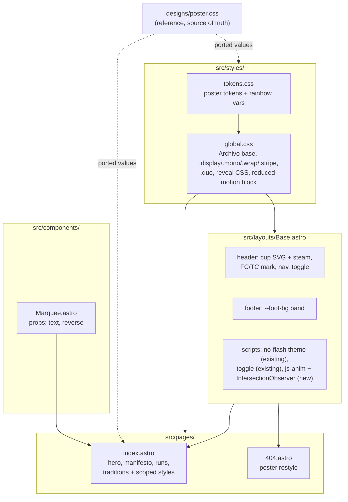

# feat: Implement the Poster homepage redesign

## Summary

Recreate the Claude Design "Poster" homepage high-fidelity in the existing
Astro codebase: Anton/Archivo/Space Mono type system, poster tokens, eight
page bands with duotone photography and the full motion layer, plus a 404
restyle and OG regeneration. Routing (`vercel.json`) and the theme
persistence mechanism are untouched.

## Problem Frame

The v1 hub landing page was an explicit structural baseline awaiting a
design pass. That pass happened in Claude Design and produced a
high-fidelity handoff (`docs/plans/design_handoff_poster_redesign/`):
big-type poster/brutalist direction, pink promoted to hero color, new
content decisions (Apps section removed, traditions updated, MSBB row,
rainbow "Surprise?"). The handoff is final on colors, type, spacing, copy,
and motion; `designs/poster.css` is the styling source of truth. The task
is recreation in the production codebase, not reinterpretation.

---

## Requirements

**Visual system**

- R1. `src/styles/tokens.css` carries the poster tokens: crema deepens to
  `#faf4e6`; theme-mapped `--line` (espresso light / crema dark),
  `--foot-bg` (espresso light / `#120d0a` dark), `--duo-tint` (pink both
  themes), `--marquee-dur` (36s), and the per-theme rainbow letter colors
  (`--rb1`–`--rb5`, contrast-tuned per the handoff table). Brand constants
  (gold/ember/flame/pink/seafoam/espresso) and the stripe gradient are
  unchanged.
- R2. Type system is Anton (display, 400 only), Archivo (body, 18px base),
  Space Mono (labels), self-hosted via fontsource. Bricolage Grotesque,
  DM Sans, and JetBrains Mono are removed from `package.json` and all CSS.
- R3. Poster structural rules hold everywhere: border-radius 0, no soft
  shadows (hard offset `5px 5px 0` shadows on hover only), 2px ink rules
  (1px `--ink-soft` for schedule sub-rules), 8px stripe, 1240px wrap,
  single 900px breakpoint plus 620px nav/CTA collapse.

**Content**

- R4. The homepage renders exactly the eight bands in the handoff: header
  (cup logo + FCTC mark + nav + toggle), hero (three display lines, meta
  row, CTAs, three-photo strip), gold marquee, full-bleed pink manifesto
  (both themes), weekly runs, traditions, reverse marquee, footer. The
  Apps card section is gone; copy matches the reference HTML verbatim.
- R5. Content changes from design review land: nav label "Wrapped";
  traditions are Anzac Day Marathon / Christmas Marathon / Aaron's
  Birthday Beer Run / Birthday Halfs with handoff blurbs; Wednesday 5th
  week is rainbow "Surprise?"; Friday rows are Summer / Winter / MSBB
  (Mount Street Breakfast Bar).
- R6. All links preserved: `/dashboard`, `/cup`, `/2025wrapped`, WhatsApp
  invite, Strava club 1156647, group events 1434762 (Wed) and 1434766 (Fri).

**Motion and accessibility**

- R7. All entrance animation is gated on a `js-anim` class added to
  `<html>` by JS only under `prefers-reduced-motion: no-preference`. Base
  CSS state is fully visible: no-JS, print, and reduced-motion users see
  complete content. A global `prefers-reduced-motion: reduce` block zeroes
  animation/transition durations.
- R8. Scroll reveals (`data-rv`, one-shot IntersectionObserver, threshold
  0.18, traditions staggered by `transition-delay`) and the manifesto
  stamp-in fire per the reference. Hero lines rise inside overflow clips
  with 0 / 0.1s / 0.2s stagger.
- R9. Hover behaviors match the reference: marquees pause, duotone photos
  bloom to color (center hero photo `.plain` stays full color), bib tags
  flip rotation, schedule rows nudge, rainbow letters wave (45ms stagger),
  "MENTAL" shakes, traditions numerals fill pink, buttons/toggle translate
  with hard shadow, logo steam wisps loop continuously.

**Plumbing invariants**

- R10. Theme mechanism is reused as-is: localStorage key `theme`, no-flash
  inline script, saved choice over OS preference, theme-color meta sync
  updated to `#faf4e6` / `#1c1410`.
- R11. Build emits nothing under `/assets` or `/data` (reserved for the
  dashboard); `vercel.json` is not modified.
- R12. The 404 page is restyled to the poster system so the site has one
  design language.
- R13. `public/og.jpg` is regenerated to represent the poster design.

---

## Key Technical Decisions

- **Token sheet replaced wholesale, one font system.** The hub's only
  pages are the homepage and 404, so the old Bricolage/DM Sans/JetBrains
  Mono stack ships nowhere once the redesign lands. Dashboard/cup font
  drift stays a future concern (handoff left this open; resolved with
  Colin at plan scoping).
- **Fontsource packages:** `@fontsource/anton` (400 is the only weight
  Anton has), `@fontsource-variable/archivo` (single variable file covers
  the 400/500/700 usage), `@fontsource/space-mono` with explicit 400 and
  700 imports. Versions verified current on npm (5.2.x).
- **CSS lives where the markup lives.** Follow the existing repo pattern:
  shared utilities and base styles in `src/styles/global.css` (`.display`,
  `.mono`, `.wrap`, `.stripe`, `.duo` duotone treatment, reveal base CSS,
  reduced-motion block), component-scoped styles in each `.astro` file.
  `designs/poster.css` is ported by section, not dropped in as one global
  sheet — but its values are authoritative; when in doubt, read it.
- **Duotone as a shared utility class.** `.duo` (grayscale + multiply
  overlay + hover bloom) is used by the hero strip and both run cards, so
  it belongs in `global.css`, not a component. The handoff's
  `data-colorhover` and `data-motion="calm"` tweak attributes are not
  ported; selectors simplify to plain `.duo:hover`.
- **Motion script in `Base.astro`.** The `js-anim` gate + one-shot
  IntersectionObserver is a few lines, no-ops on pages without `data-rv`,
  and lets the 404 opt into reveals. The stamp's `stamped` class hook
  rides the same observer (per the reference implementation).
- **Theme key stays `theme`.** The prototype's `fctc-poster-theme`
  localStorage key is prototype-only; the handoff explicitly says to reuse
  the existing `Base.astro` mechanism.
- **Rainbow letters generated at build time.** The per-letter spans with
  `--i` custom properties are mapped from a string in the Astro template,
  not hand-written, so the cycle works for any future label. The wrapper
  carries `aria-label="Surprise?"` (per the reference HTML) so assistive
  tech reads the word, not nine individual letters.
- **OG image = headless-Chrome capture of the hero band at 1200x630.**
  The poster typography is the brand now; a crop of the live hero (type +
  photo strip) represents it better than a treated photo.
- **404 restyle is an interpretation, not in the handoff.** Poster
  system applied to the existing copy: Anton display headline, mono tag,
  square-cornered button, Trigg sunrise photo in pink duotone. Confirmed
  in scope with Colin at plan scoping.

---

## High-Level Technical Design

Where the poster's pieces land in the existing file structure, and what
moves between files:

Prototype-to-production deltas worth naming: Google Fonts → fontsource;
`fctc-poster-theme` key → existing `theme` key; per-letter rainbow spans →
template map; `data-motion`/`data-colorhover` tweak hooks → dropped;
`` → `astro:assets` `<Image>` with responsive widths.

---

## Implementation Units

### U1. Poster foundation: tokens, fonts, global styles

- **Goal:** The poster's design system exists site-wide — new fonts load,
  tokens carry the handoff values, shared utilities and motion-gating CSS
  are in place.
- **Requirements:** R1, R2, R3, R7 (CSS half)
- **Dependencies:** none
- **Files:** `package.json`, `src/styles/tokens.css`,
  `src/styles/global.css`
- **Approach:** Swap fontsource deps (remove bricolage/dm-sans/jetbrains,
  add anton/archivo-variable/space-mono). Rewrite `tokens.css` per the
  handoff token table (crema `#faf4e6`, `--line`, `--foot-bg`,
  `--duo-tint`, `--marquee-dur`, rb1–rb5 light/dark). Rewrite
  `global.css`: Archivo 18px body, `.display`/`.mono` type utilities,
  `.wrap` at 1240px, 8px `.stripe`, `.duo` duotone + bloom, the
  `html.js-anim [data-rv]` reveal base, and the global reduced-motion
  kill block. Old link/selection/heading styles tied to the previous
  system are removed, not kept alongside.
- **Patterns to follow:** existing `tokens.css` → `global.css` pipeline
  and its comment voice; values verbatim from `designs/poster.css`.
- **Test scenarios:** Test expectation: none — pure styling foundation,
  no behavior. Visual verification happens per-band in U3.
- **Verification:** Build is green; built CSS contains Anton/Archivo/
  Space Mono font files and none of the old families; no `border-radius`
  anywhere in shipped CSS.

### U2. Chrome: header, footer, motion script in Base.astro

- **Goal:** Site chrome matches the poster bands and the motion plumbing
  exists for any page.
- **Requirements:** R4 (header/footer bands), R6 (nav links), R7 (JS
  half), R8 (observer), R9 (toggle hover, steam loop, footer hover), R10
- **Dependencies:** U1
- **Files:** `src/layouts/Base.astro`, `src/components/Marquee.astro`
- **Approach:** Header: copy the cup SVG paths verbatim from the
  reference HTML, steam wisps stroked pink with the 2.8s loop (s2 delayed
  1.4s, `js-anim`-gated); `FC<b>TC</b>` Anton mark; nav Dashboard/Cup/
  Wrapped in Space Mono with pink hover underline; square toggle with
  translate + hard-shadow hover. Footer: `--foot-bg` band, centered nav
  (apps + WhatsApp + Strava, gold hover), side labels. Keep the no-flash
  script and toggle logic as-is, updating only the theme-color hexes.
  Add the motion script: `js-anim` class gated on
  `prefers-reduced-motion: no-preference`, one-shot IntersectionObserver
  (threshold 0.18) adding `.rv` (and `.stamped` for the stamp element).
  Marquee.astro gains `text` and `reverse` props, gold band styling per
  reference, `--marquee-dur` animation, pause on hover.
- **Patterns to follow:** existing `Base.astro` script structure (inline
  no-flash + module toggle script); reference HTML lines for the SVG and
  observer.
- **Test scenarios:** Test expectation: none — no test framework in repo;
  behavioral checks are enumerated in Verification and run in a real
  browser during U5.
- **Verification:** Theme persists across reload with no flash (saved
  choice beats OS pref); toggling updates theme-color meta to
  `#faf4e6`/`#1c1410`; with JS disabled all content is visible and no
  `js-anim` class is present; with reduced-motion OS setting, no
  entrance animation plays; steam wisps loop only under `js-anim`; nav
  links hit `/dashboard`, `/cup`, `/2025wrapped`.

### U3. The homepage: eight bands, full fidelity

- **Goal:** `src/pages/index.astro` is the poster — every band, every
  copy change, every hover behavior.
- **Requirements:** R3, R4, R5, R6, R8, R9
- **Dependencies:** U1, U2
- **Files:** `src/pages/index.astro`
- **Approach:** Rebuild section by section against the reference HTML and
  `poster.css`: hero (three clipped display lines with rise stagger, meta
  row between 2px rules, square CTAs, three-photo duotone strip with
  full-color center), gold marquee ("FILAMENT COFFEE • COLD BREW • RUN"),
  pink manifesto (creed at line-height 1.05 with outlined shaking
  "MENTAL" and gold "WANT.", stamp with stamp-in, foot paragraph
  `#f6d7de`), weekly runs (bordered two-column grid, duotone card photos,
  bib tags, schedule lists with rainbow "Surprise?" mapped from a string,
  Strava event links), traditions (numbered 200px/1.1fr/1.2fr rows,
  outlined 96px numerals filling on hover, four new traditions), reverse
  marquee ("AMEN SCOUNDRELS • SEE YOU AT 0530"), all `data-rv` placements
  matching the reference. Apps section and its card data are deleted.
  Photos via `astro:assets` `<Image>` with responsive widths as today;
  meta description updated to the new voice if needed (times already
  correct).
- **Patterns to follow:** reference HTML for markup/copy verbatim;
  `poster.css` for every value; existing `<Image>` usage for widths/sizes.
- **Test scenarios:** Test expectation: none — no test framework; this
  unit is the visual fidelity target, verified by side-by-side screenshot
  comparison in U5.
- **Verification:** Side-by-side with the reference prototype at 1440px
  and 390px in both themes shows matching layout, type scale, colors, and
  copy; all six external/app links resolve; rotation content matches the
  handoff (1st Intervals → 5th rainbow "Surprise?"; Summer/Winter/MSBB).

### U4. 404 restyle and photo set cleanup

- **Goal:** The 404 speaks the poster language; unused photos leave the
  shipping set.
- **Requirements:** R12, plus R3 consistency
- **Dependencies:** U1, U2, U3 (the photo deletions require the
  index.astro rewrite — the current homepage still imports three of the
  four files; the 404 restyle itself only needs U1/U2)
- **Files:** `src/pages/404.astro`, `src/assets/photos/` (deletions)
- **Approach:** Keep the existing 404 copy ("You've run past the
  turnaround", soft-sand line, back-to-start button); restyle: Anton
  display headline, Space Mono tag and square button, Trigg sunrise in
  `.duo` pink duotone, square corners, 2px rules. Delete now-unused
  photos from `src/assets/photos/`: `filament-sign.jpg`,
  `run-mental.jpg`, `sock-game.jpg`, `perth-skyline.avif` (the skyline
  was never wired up). Originals remain in the gitignored local `assets/`
  folder.
- **Patterns to follow:** U3's band styling; existing 404 structure.
- **Test scenarios:** Test expectation: none — styling and asset removal;
  checks in Verification.
- **Verification:** `/definitely-not-a-page` returns 404 with the poster
  look in both themes; build succeeds with no dangling image imports;
  repo contains no unreferenced files under `src/assets/photos/`.

### U5. OG image, screenshot review, final checks

- **Goal:** Social card matches the new brand; the redesign is verified
  the same way previous units were.
- **Requirements:** R11, R13, and end-to-end verification of R7–R10
- **Dependencies:** U3, U4
- **Files:** `public/og.jpg`, `review/` (gitignored scratch)
- **Approach:** Capture the built hero band at exactly 1200x630 with
  headless Chrome and replace `public/og.jpg`. Regenerate the review page
  with a v3 section on top: desktop + mobile, light + dark full-page
  shots plus the 404, alongside the handoff's own screenshots for
  comparison. Run the U2 behavioral checks (theme persistence, no-JS,
  reduced-motion) in a real browser. Confirm `dist/` emits only
  `_astro/`, the HTML pages, favicon, and `og.jpg` — nothing under
  `/assets` or `/data`.
- **Patterns to follow:** the existing `review/index.html`
  newest-on-top convention and the headless-Chrome screenshot recipe
  (dark mode via the patched-dist trick).
- **Test scenarios:** Test expectation: none — this is the verification
  unit; its output is the evidence.
- **Verification:** Review page opens with v3 sections; OG renders at
  1200x630 with poster typography; reserved-namespace check passes;
  parity script untouched and still executable.

---

## Scope Boundaries

- **Not touched:** `vercel.json`, `scripts/check-routes.sh`, the theme
  persistence mechanism, the hub plan's U4/U5 (deploy, DNS cutover,
  firewall) — those still follow the original hub plan after this lands.

### Deferred to Follow-Up Work

- Drifting the dashboard and cup apps toward the poster token sheet
  (handoff names this as an eventual direction; separate repos).
- The `data-motion="calm"` site-wide reduced-energy setting (handoff:
  "only worth porting if you want a site-wide 'less motion' setting").
- Hero video loop from the 225MB local original (predates this redesign;
  the poster design doesn't call for video).

---

## Sources & Research

- `docs/plans/design_handoff_poster_redesign/README.md` — the handoff
  spec (origin); content decisions and fidelity expectations.
- `docs/plans/design_handoff_poster_redesign/designs/poster.css` — the
  styling source of truth; every CSS value in this plan defers to it.
- `docs/plans/design_handoff_poster_redesign/FCTC Site - The Poster.html`
  — markup, copy, SVG paths, and motion JS reference (ignore the
  React/Babel Tweaks panel block).
- Fontsource availability verified on npm 2026-06-10: `@fontsource/anton`
  5.2.7, `@fontsource-variable/archivo` 5.2.8, `@fontsource/space-mono`
  5.2.9.
